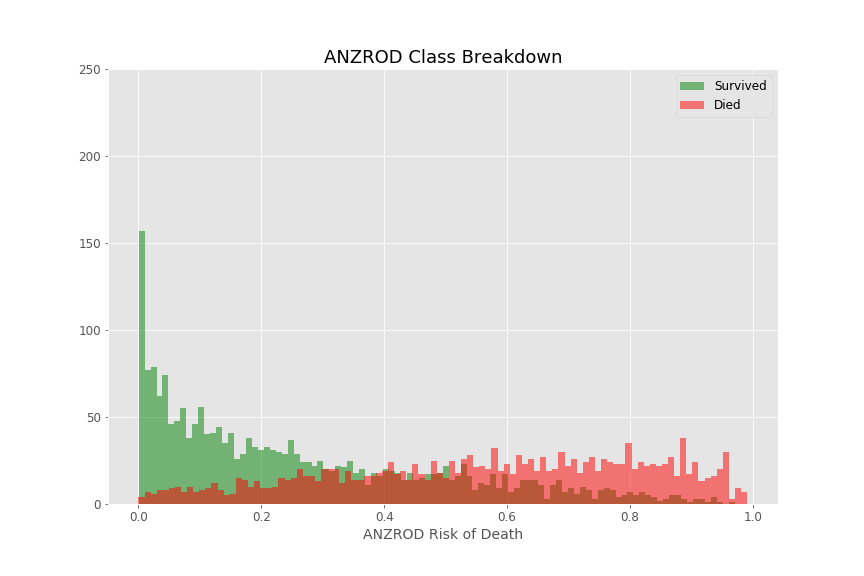
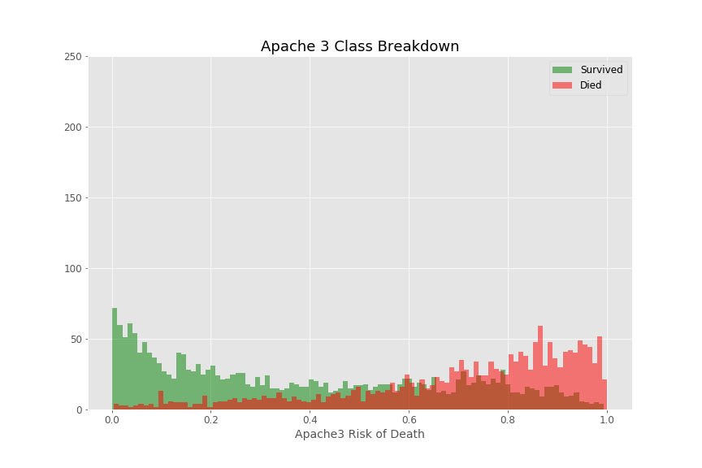
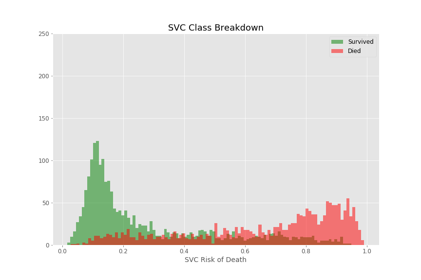
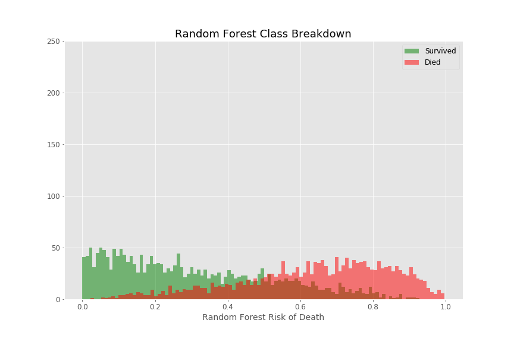
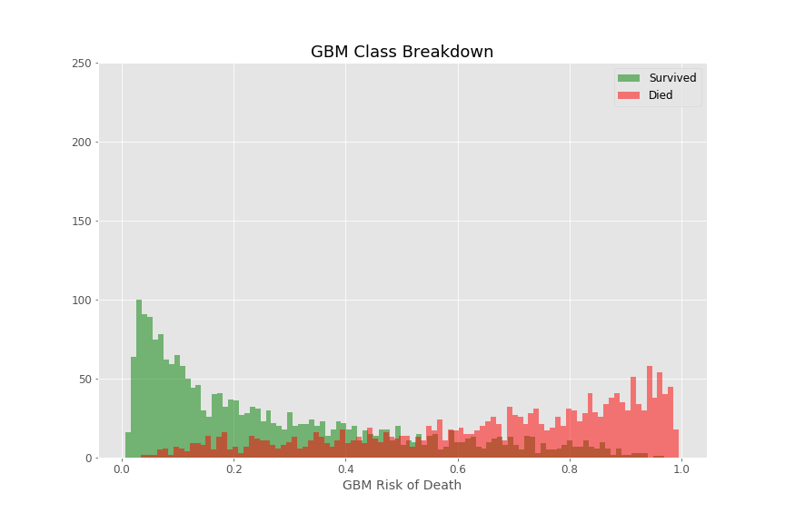
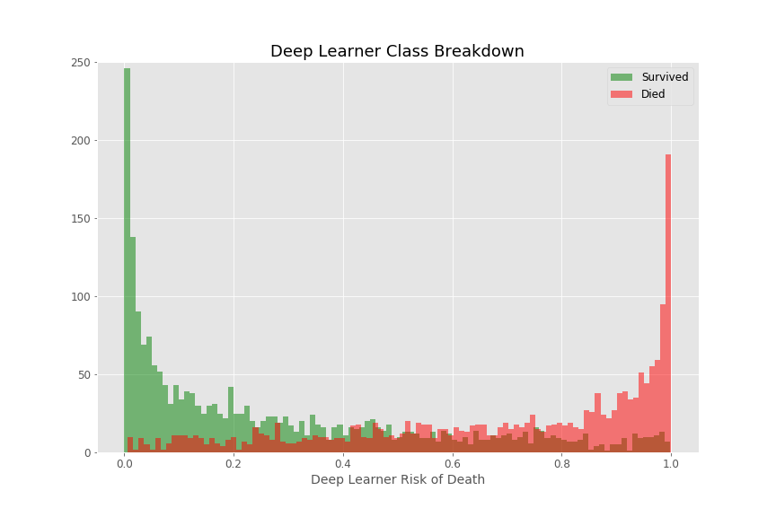
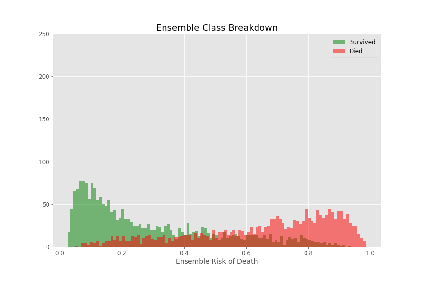
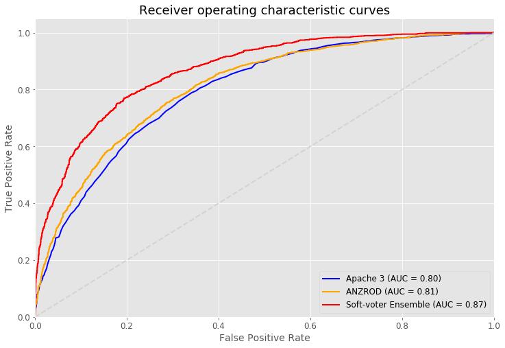
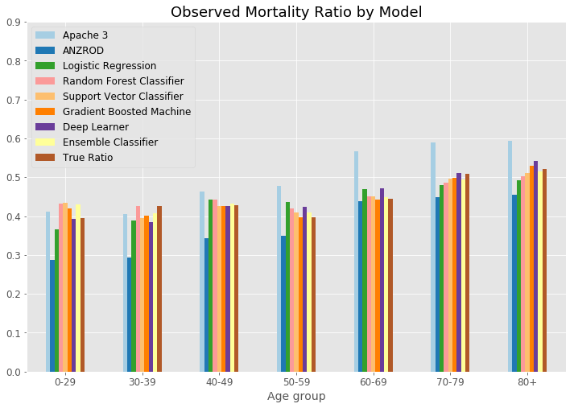

# Predicting Mortality post Cardiac Arrest, on ANZICS
We used a variety of machine learning algorithms to predict the mortality outcome for patients following a cardiac arrest. The summary results are shown below.

## Results

